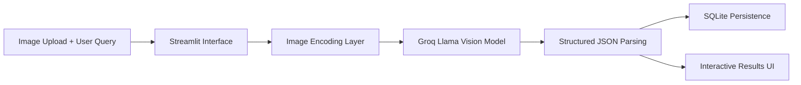

# 🤖 Structured Multimodal AI Agent

<p align="center">
  
</p>

<h1 align="center">
  🧠 Multimodal Insight Engine
</h1>

<h3 align="center">
  Bridging Vision and Logic into Structured Intelligence
</h3>

<p align="center">
  <strong>From Raw Pixels → Actionable JSON Data</strong><br/>
  <em>Stop just describing images. Start extracting structured, programmable insights.</em>
</p>

<p align="center">
  <a href="#-current-capabilities"></a>
  <a href="#-system-architecture"></a>
  <a href="#-quick-start"></a>
</p>

<p align="center">
  
  
  
  
</p>

---

# 📊 Project Vision

<table>
<tr>
<td width="60%">

## The Core Idea

Most beginner vision AI apps only generate image descriptions.

This project explores something more useful:

> Turning images into structured, machine-readable intelligence.

Instead of returning plain text captions, the system combines:
- image understanding
- user intent
- multimodal reasoning
- structured JSON generation
- persistent storage

The result is a lightweight multimodal agent pipeline capable of producing actionable outputs from visual inputs.

---

## What This Project Explores

This project was built as a learning-focused exploration into:

- Multimodal AI systems
- Vision + language reasoning
- Structured LLM outputs
- JSON-constrained responses
- Persistent memory using SQLite
- AI application architecture
- Prompt engineering
- Streamlit-based AI interfaces

---

## Current Capabilities

The agent can:

- Upload and analyze images
- Accept natural language questions
- Reason across image + text together
- Generate structured JSON responses
- Store analysis history in SQLite
- Display historical analyses inside the UI

The output schema changes dynamically depending on:
- the uploaded image
- the user’s question
- the inferred task

Examples include:
- receipt analysis
- product evaluation
- note summarization
- visual reasoning tasks

</td>
<td width="40%" align="center">

## ⚡ Current Stack

| Component | Technology |
|:------|:-----|
| **Vision Model** | Llama 4 Scout |
| **Inference Engine** | Groq API |
| **Frontend** | Streamlit |
| **Persistence** | SQLite |
| **Language** | Python |

<br/>

## 🧠 Key Concepts Learned

- Multimodal inference
- Structured JSON prompting
- API orchestration
- Base64 image handling
- Persistent AI workflows
- Database integration
- Modular AI system design

<br/>

## 🚀 Future Improvements

- OCR tool integration
- Prompt routing
- Image storage system
- PostgreSQL migration
- Vector search
- Multi-step agents
- Tool calling
- Async processing

</td>
</tr>
</table>

---

# 🏗️ System Architecture



---

# 📸 Application Preview

## Main Interface


## Structured JSON Output


---

# 📂 Project Structure

```text
multimodal-agent/
│
├── app.py
├── db.py
├── requirements.txt
├── README.md
├── .gitignore
├── .env
├── agent_data.db
│
├── screenshots/
│   ├── app.png
│   └── output.png
│
└── venv/
```

---

# ⚙️ How It Works

The application follows a simple multimodal reasoning pipeline:

1. User uploads an image
2. User asks a question about the image
3. Image is converted into base64 format
4. Image + text are sent together to the LLM
5. Groq executes multimodal inference
6. Model returns structured JSON output
7. JSON is parsed and validated
8. Analysis is stored inside SQLite
9. Previous analyses are displayed in history

---

# 🧪 Example Use Cases

## 🛍️ Product Analysis

**Input:** Product image + “Should I buy this?”

```json
{
  "buy": true,
  "score": 8,
  "best_for": "short travel",
  "concerns": ["small storage capacity"],
  "verdict": "Good for lightweight travel use"
}
```

---

## 🧾 Receipt Analysis

**Input:** Receipt image + “Am I overspending?”

```json
{
  "total_spent": 3847,
  "largest_category": "food",
  "verdict": "overspending"
}
```

---

## 📝 Whiteboard Summary

**Input:** Meeting notes image + “Summarize this meeting”

```json
{
  "topic": "Sprint Planning",
  "action_items": [
    "Review API",
    "Deploy authentication"
  ],
  "open_questions": [
    "Which cloud provider to use?"
  ]
}
```

---

# 🚀 Quick Start

## 1. Clone Repository

```bash
git clone https://github.com/YOUR_USERNAME/multimodal-agent.git
cd multimodal-agent
```

---

## 2. Create Virtual Environment

### Windows

```bash
python -m venv venv
venv\Scripts\activate
```

### Mac/Linux

```bash
python3 -m venv venv
source venv/bin/activate
```

---

## 3. Install Dependencies

```bash
pip install -r requirements.txt
```

---

## 4. Configure Environment Variables

Create a `.env` file:

```env
GROQ_API_KEY=your_api_key_here
```

---

## 5. Run the Application

```bash
streamlit run app.py
```

---

# 📦 Requirements

Core dependencies:

- streamlit
- groq
- python-dotenv

---

# 🧠 Technical Concepts Demonstrated

This project demonstrates:

- Multimodal LLM integration
- Vision-language reasoning
- Structured JSON enforcement
- Prompt engineering
- SQLite persistence
- Streamlit application design
- API orchestration
- Local AI workflow architecture

---

# 🔒 Security Notes

- Never commit `.env` files
- Never expose API keys publicly
- `.gitignore` excludes sensitive files automatically

---

# 🌱 Future Roadmap

## Planned Enhancements

- OCR pipeline integration
- Image classification routing
- Prompt specialization
- Tool-calling workflows
- PostgreSQL backend
- Authentication system
- Cloud deployment
- Async job queue
- Vector database integration
- Agent memory system

---

# 🎯 Learning Goals

This project was built to better understand:

- How multimodal AI systems work
- How structured LLM outputs improve reliability
- How AI pipelines are architected
- How persistent storage integrates with AI workflows
- How to move from “AI demos” to real AI systems

---

# 📜 License

This project is open-source and available under the MIT License.

---

# ⭐ Acknowledgements

Built for learning and experimentation with:
- Groq
- Llama Vision Models
- Streamlit
- SQLite
- Python AI workflows

---

<p align="center">
  <strong>🧠 From Vision → Reasoning → Structured Intelligence</strong>
</p>
